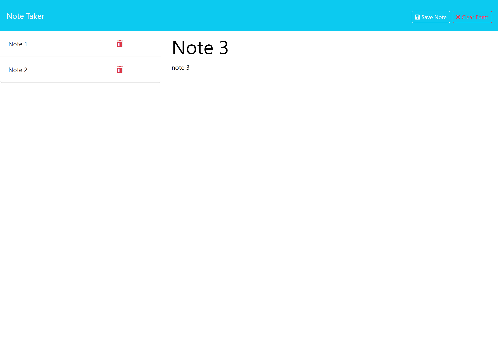

# Note Taker Starter Code
  

  ## Description 
    Project to create the back-end code of an application that enables the user to create notes that persist in the application. The primary focus of the project was on creating routes using express that corresponded to http fetch requests in the front-end code.

  ## Table of Contents

  - [Installation](#installation)
  - [Usage](#usage)
  - [License](#license)
  - [Contributing](#contributing)
  - [Tests](#tests)
  - [Questions](#questions)  

  ## Installation
    Install dependincies 'express' and 'uuid'.

  ## Usage

  #### [link to the application demonstration video](https://app.screencastify.com/v3/watch/ho7sR5ELPObZIYovXBcZ)
  #### [link to the git repository](https://github.com/rozierhj/express.js.mod11)
  #### [link to the website](https://express-js-mod11.onrender.com/)

  In the homepage, click on the Get Started button. Ones in the note taking page, select the Note Title field and enter a title for the note. Next, select the Note text field and enter the main text for the note. In the upper, right corner of the page there will be two buttons. The Save Note button allows you to save your note in the application, the Clear Form button clears the text in the note.
  Once you've saved your first note it will appear in the notes list in the left column of the page. You can click on any of the notes in that column to view their text. You can click on the trash can icon beside the note in the notes column to delete it.

  Webpage Design

  ## License

  Application is covered under the [MIT license](https://opensource.org/licenses/MIT)

  ## Contributing
    n/a

  ## Tests
    n/a

  ## Questions

  #### Github user profile for: [rozierhj](https://github.com/rozierhj)
  #### For more information, you can email at: [hunter.rozier@yahoo.com](hunter.rozier@yahoo.com)